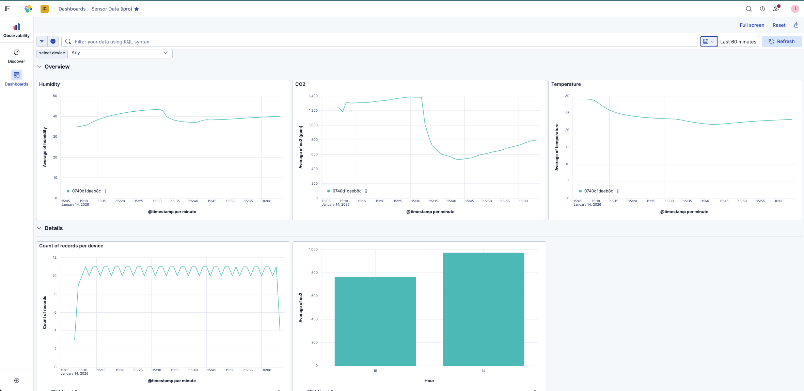
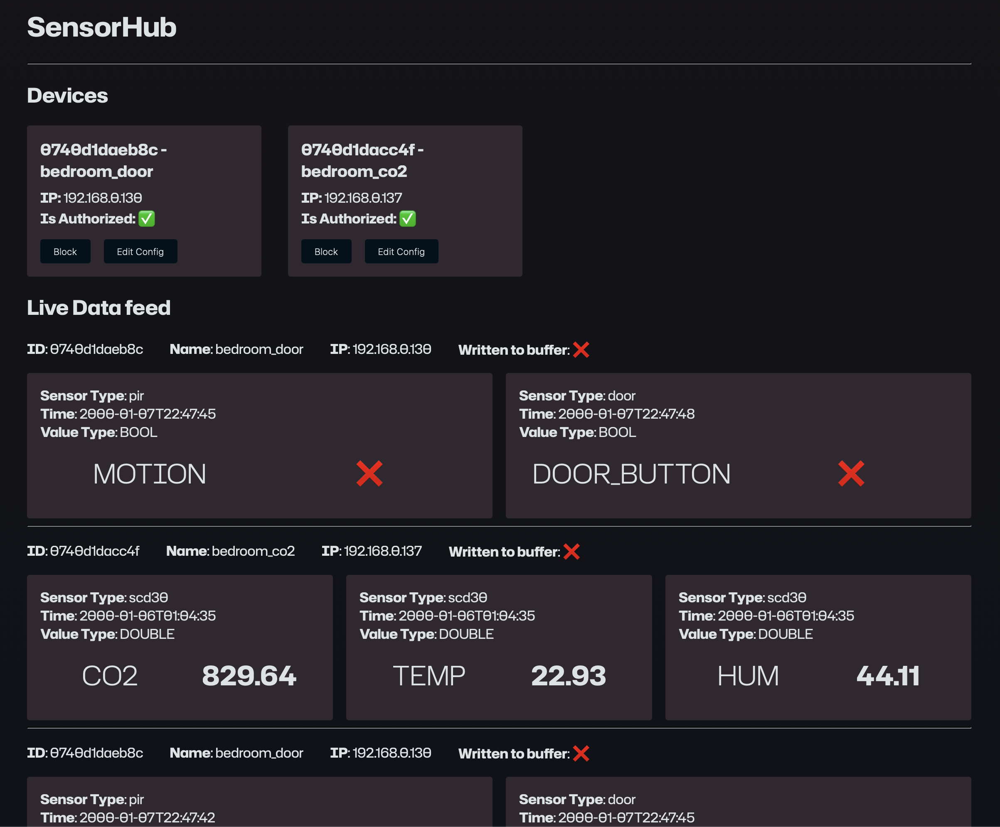
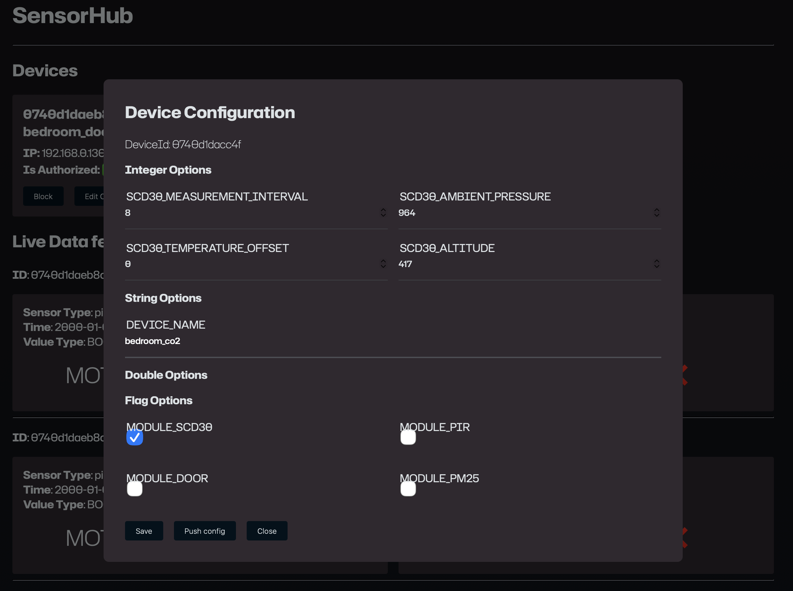
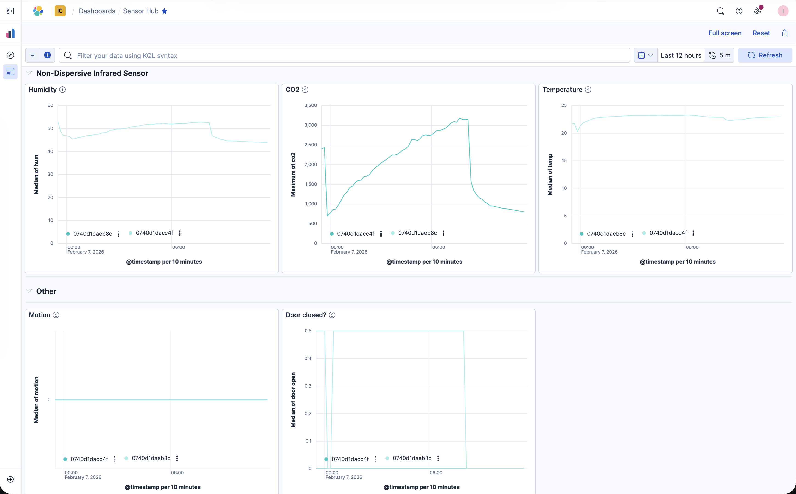

# FHNW (ipro) Indoor Climate
FHNW (ipro) is a mandatory individual software project, worth 6 ETCS.

## Overview
In [this project](http://www.tamberg.org/fhnw/2025/hs/IproIndoorClimate.pdf) I will use CO2 sensors to measure indoor climate.

## Levels
To keep you motivated, this project template is split into levels.

- [x] Level 0: [Getting started](level-0/README.md)
- [x] Level 1: [Logging sensor data](level-1/README.md)
- [x] (SKIPPED) Level 2: [Analyzing your data](level-2/README.md)
- [x] Level 3: [Monitoring remotely](level-3/README.md)
- [x] Level 4: [Scaling up and out](level-4/README.md)

## Results
Each level results in a working prototype, built from building blocks.

### Level 1
My prototype after this level is a working sensor that sends data over serial, a script written in go that reads the serial port and stores the data in csv files and a python script that reads the files and plots a chart using the data.
In regard to my project goal (getting to know MQTT) this concludes Level 1 for me. I could certainly improve this prototype either by drawing plots using live data and/or by storing the data in a proper database.

### Level 2
This level was skipped.

### Level 3
<kbd></kbd>

My prototype from the third level is a working sensor that sends json data every 5 seconds to an online web api. This service then enriches the data and sends it to an Elasticsearch DB. The data can be read and evaluated in Kibana. The [Kibana Dashboard can be accessed here](https://kibana.michu-tech.com/s/indoor-climate/app/dashboards#/view/9df80984-140a-48b2-b364-bd9b4bb9c807?_g=(filters:!(),refreshInterval:(pause:!t,value:60000),time:(from:now-60m,to:now))). Use the User `ipro` to login. Reach out to me for the password.

This concludes level 3 for me. In the next level, I'll try to improve some of the shortcomings of this prototype.

### Level 4 | SensorHub
For the last level I have created and deployed the SensorHub application. A more detailed documentation can be found in the project log or the readme in the level-4 directory. Here is just an overview of the result.

SensorHub is a combination of components that dynamically reads, stores and visualizes data from any micro controller with any connected sensors. Any newly connected micro controller has to be "authorized" by someone. Data received from unauthorized devices is cached but not stored in elastic search until the device is authorized.
Devices can publish modifiable configuration options. These options can then be changed by the SensorHub frontend. Devices will periodically read and update their configuration. 

All received data is logged in the SensorHub frontend and visualized in Kibana.

#### SensorHub Frontend
<kbd></kbd>

On this image, you can see that two devices have sent data to my backend. Both devices are authorized.  
Also you can see the most recent received messages. The first one is from the device called `bedroom_door`. This device sent two boolean values. One called "motion" and one called "door_button". The data was not cached, because the device is authorized. The `time` value is a clock that started ticking when the device first had power. Don't worry, this is just additional information and is not used for any technical thing, currently (it can be used to see the uptime for example).
The second row is a message from a different device. This one sent three floating point numbers .

<kbd></kbd>

This is what you see, when you press the `Edit Config` button on a device. It shows, that the device with the ID 0740d1dacc4f can be configured in these nine values. These values are not hardcoded by sensor hub, but the device itself informed everyone that these values can be modified. I can now change the values and send them to the device. 
The device will receive a notification with the updated config, wait for all running processes to stop (depends on the sensor reader implementation, usually takes 30 seconds or so), then it will apply the new configuration and finally restart. In case of an issue, the current configuration stored in the backend can also be pushed again.

#### Kibana
<kbd></kbd>  
This shows the Kibana Dashboard I have created. 
The `Meta data` section shows information about the received data and connected devices. On the left is a table with all the devices that sent data in the last 12 hours. The chart in the middle shows the count of new documents (how much data was received). If this line is always straight, then everything seems to be okay. And on the left is a pie chart that compares the amount of data received from each device.

The `Live` section shows the most recent value of each sensor, split by devices. In the current device setup, no two devices have the same sensor, so for each sensor is only one value.

<kbd></kbd>  
The `Non-Dispersive Infrared Sensor` section shows the data received from all CO2 sensors. Unfortunately there is only one CO2 sensor, so each chart only has one line, if there were multiple CO2 sensors, there would also be multiple lines in the charts.

The `Other` section shows all other data that was received. On the left we can see that there was no motion seen in the last 12 hours and on the right we can see when the door was open and when closed. (line up means door is closed)

#### Access
All this runs in my local network. [The Kibana Dashboard can be accessed here](https://kibana.michu-tech.com/s/indoor-climate/app/dashboards#/view/23852b6b-86cc-4a94-896b-499aec733026?_g=(filters:!())). Use the User `ipro` to login. I will share the password on request.
[My frontend can also be accessed here](https://sensor_hub.michu-tech.com). But it is also behind a login wall and I will only give out a user on special requests.

## Goals
I am used to writing backends and frontends to process data, but working with sensors is entirely new to me.
So my goal for this project is to understand how I can work with simple sensors. How do I have to receive and process the data inorder to do something meaningful with it.  
Ultimately, I want to understand and use MQTT. 

Steps: 
- [x] Get to know micro:bit
- [x] read and process sensor data over a serial connection
- [x] read and process sensor data over a WiFi connection
- [x] implement MQTT service to receive data from n sensors and process their data
- [x] implement backend that sends structured sensor data to elastic
- [x] create a simple kibana dashboard
- [x] (optional) handwrite my own web frontend for data visualization

### Evaluation
With SensorHub I could achieve the goals I have set at the beginning of the project.
During the planning and implementation phase of SensorHub I had some more Ideas that I could not implement due to time constraints. But the broader goals could be completed.

## Language
I am trying to experiment with languages. I'll use whatever programming language I think is most suitable for the task at hand.

## "AI" tools
No LLM code is copied into this repository directly. But depending on the task, I'll be consulting LLMs more. Similar to how I used to use Google to learn something, I now use LLMs to learn about programming patterns. In the project-log.md I will keep track of the tasks where I heavily relied on LLM input.

## Support
Contact thomas.amberg@fhnw.ch to get an MS Teams invite.

> Note: Work in progress. Interested? Contact thomas.amberg@fhnw.ch

## License
Unless noted otherwise.

* Source code examples in this repository are declared Public Domain [CC0 1.0](https://creativecommons.org/publicdomain/zero/1.0/)
* Content by [A. Kennel](https://www.fhnw.ch/de/personen/andrea-kennel), [G. Deck](https://www.fhnw.ch/en/people/klaus-georg-deck), [T. Amberg](https://www.fhnw.ch/en/people/thomas-amberg), FHNW is licensed under [CC BY-SA 4.0](https://creativecommons.org/licenses/by-sa/4.0/)

Publishing your own code?
[MIT License](https://choosealicense.com/licenses/mit/)
