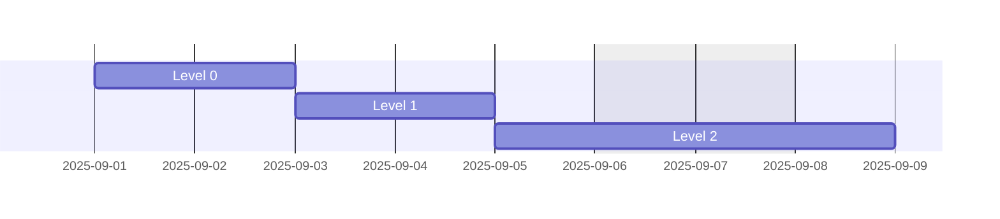

# Level 0: Getting started
To manage your time, update this schedule.



## Goals
To finish the level, achieve these goals.

- [ ] Have a rough plan when to do what
- [ ] Check in with your support team
- [ ] Be ready to work on this project

## Building blocks
To achieve the goals, use these blocks.

- [ ] [Set up Github and git for version control](#set-up-github-and-git-for-version-control)
- [ ] [Create a private copy of this repository](#create-a-private-copy-of-this-repository)
- [ ] [Commit and push to your copy of the repo](#commit-and-push-to-your-copy-of-the-repo)
- [ ] [Use the terminal or cmd, to work with files](#use-the-terminal-or-cmd-to-work-with-files)
- [ ] [Set up a Java or Python IDE, e.g. VS Code](#set-up-a-java-or-python-ide-eg-vs-code)
- [ ] [Set an environment variable $REPO_PATH](#set-an-environment-variable-repo_path)
- [ ] [Use a venv virtual environment with Python](#use-a-venv-virtual-environment-with-python)
- [ ] [Plan and update a project schedule](#plan-and-update-a-project-schedule)
- [ ] [Keep a project log to take notes](#keep-a-project-log-to-take-notes)
- [ ] [Learn how to make a prototype](#learn-how-to-make-a-prototype)
- [x] [Check done items off the list](#check-done-items-off-the-list)

### Set up Github and git for version control
- Sign up for a free [Github](https://github.com/) account
- Install [git version control](https://git-scm.com/downloads)
- Make sure _git_ works
    ```console
    $ git --version
    ```

### Create a private copy of this repository
> Note: Do not _fork_ the respository
- Visit https://github.com/fhnw-imvs/fhnw-ipro-indoor-climate
- Click _Use this template_
- Select _Create new repository_
- Name it _fhnw-ipro-indoor-climate-USER_, e.g.
    ```
    fhnw-ipro-indoor-climate-tamberg
    ```
- Choose visibility _Private_
- Click _Create repository_

### Commit and push to your copy of the repo
Commit and push to store and backup your project.

- Check the status of the repo
    ```console
    $ git status
    ```
- Add a new file, e.g. _my.txt_
    ```console
    $ git add my.txt
    ```
- Commit local changes
    ```console
    $ git commit my.txt
    ```
- Pull remote changes
    ```console
    $ git pull
    ```
- Push to upload changes
    ```console
    $ git push
    ```

### Use the terminal or cmd, to work with files
#### With cmd (on Win)
...

#### With Terminal (on MacOS, Linux)

- List the current directory
    ```console
    $ ls -l
    ```
- Change the current directory
    ```console
    $ cd ..
    ```
- Check the current path
    ```console
    $ pwd
    ```
- Read an ASCII file
    ```console
    $ cat my.txt
    ```
- Write an ASCII file
    ```console
    $ nano my.txt
    ```
    (CTRL-X, Y, ENTER to save changes)
- Remove a file
    ```console
    $ rm my.txt
    ```

### Set up a Java or Python IDE, e.g. VS Code
#### With VS Code (any OS)
- Install [Visual Studio Code](https://code.visualstudio.com/download)
- Set up [VS Code for Java](https://code.visualstudio.com/docs/languages/java)
- Set up [VS Code for Python](https://code.visualstudio.com/docs/languages/python)

#### With Terminal (on MacOS, Linux)
> Note: This is hard mode, no IDE magic!

- Use _nano_ or any text editor to edit code
- Install Java, e.g. [OpenJDK](https://openjdk.org/) or [AWS Corretto](https://aws.amazon.com/corretto/)
- Make sure _javac_ and _java_ are installed
    ```console
    $ javac --version
    $ java -- version
    ```
- Use the provided shell scripts for Java
- Make sure _python3_ and _pip3_ are installed
    ```console
    $ python3 --version
    $ pip3 -- version
    ```
- Use the provided commands for Python

### Set an environment variable $REPO_PATH
To work with absolute paths based on the repository path.

> Note: In most cases, relative paths are preferred

- Set a temporary environment variable
    ```console
    $ REPO_PATH=$(git rev-parse --show-toplevel)
    ```
- Show the content of _$REPO_PATH_
    ```console
    $ echo $REPO_PATH
    ```

### Use a venv virtual environment with Python
To work with Python, use a [virtual environment](https://docs.python.org/3/library/venv.html).

- Install a project-specific _venv_, once
    ```console
    $ cd $REPO_PATH
    $ python3 -m venv venv
    ```
- Activate the _venv_, to work with Python
    ```console
    $ source venv/bin/activate
    (venv) $ python --version
    ```
- Deactivate the _venv_, to stop working
    ```console
    $ deactivate
    ```
- Uninstall the _venv_, to move the project
    ```console
    $ rm -r venv
    ```

### Plan and update a project schedule
Manage your time and workload.

- Create e.g. a [Gantt chart](https://docs.mermaidchart.com/mermaid-oss/syntax/gantt.html)
- Find out what to do next
- See how much time is left
- Update the plan regularly

### Keep a project log to take notes
Take notes for yourself.

- Explore alternatives in parallel
- Find again what you already tried
- Include your command line history
    ```console
    $ history
    ```
- Consider using `>` to add notes
> Like this, right here.
- Or use a .TXT file per day, e.g.
    ```
    $ nano Notes_v20250823.txt
    ```

### Learn how to make a prototype
How to [make a prototype](http://www.tamberg.org/bowen/2024/MakeAPrototypeWithEmbeddedML.pdf).

- Draw a sketch
- Start simple, iterate
- Test separately, then combine
- Go back to a working state

### Check done items off the list
Edit each [README.md](README.md) to check off `[x]` done items.

## Side quests
To learn more, consider these side quests.

- [ ] Set up an SSH key to simplify Github usage
- [ ] Set up a terminal program like screen or PuTTY
- [ ] Get used to Windows Subsystem for Linux (WSL 2.0)
