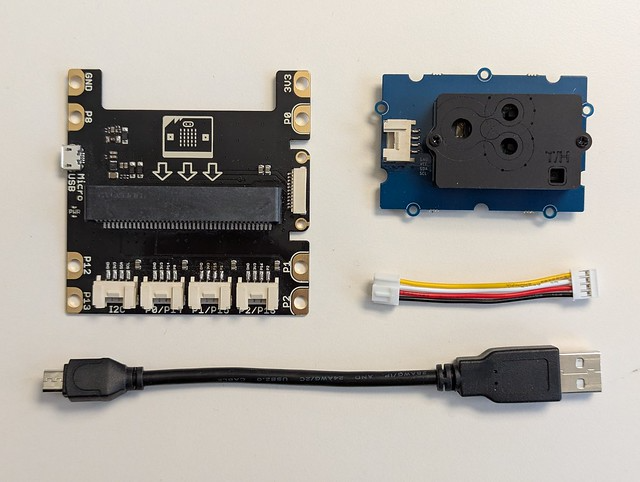

# Level 1: Logging sensor data
To document your setup, update this sketch.

<kbd></kbd>

## Goals
To finish the level, achieve these goals.

- [ ] Read a CO2 sensor, on the Microbit
- [ ] Send data via USB, to your computer
- [ ] Store sensor data, on your computer
- [ ] Read stored data, on your computer
- [ ] Show historical data as a chart
- [ ] Build an end-to-end prototype

## Building blocks
To achieve the goals, use these blocks.

- [ ] [Get a Microbit hardware kit](#get-a-microbit-hardware-kit)
- [ ] [Use the Microbit with MakeCode](#use-the-microbit-with-makecode)
- [ ] [Read a value from an I2C sensor](#read-a-value-from-an-i2c-sensor)
- [ ] [Write ASCII bytes to a serial port](#write-ascii-bytes-to-a-serial-port)
- [ ] [Read ASCII bytes from a serial port](#read-ascii-bytes-from-a-serial-port)
- [ ] [List available devices, serial ports](#list-available-devices-serial-ports)
- [ ] [Store data in CSV format into a file](#store-data-in-csv-format-into-a-file)
- [ ] [Open a CSV file as a spreadsheet](#open-a-CSV-file-as-a-spreadsheet)
- [ ] [Import a CSV file into a notebook](#import-a-CSV-file-into-a-notebook)
- [ ] [Run a database as a local service](#run-a-database-as-a-local-service)
- [ ] [Use a database client to test SQL](#use-a-database-client-to-test-sql)
- [ ] [Store data into a database with SQL](#store-data-into-a-database-with-sql)
- [ ] [Read data from a database with SQL](#read-data-from-a-database-with-sql)
- [ ] [Visualize data in a visual component](#visualize-data-in-a-visual-component)

### Get a Microbit hardware kit
Borrow these items from the [FHNW IoT Hardware Library](https://github.com/fhnw-imvs/fhnw-iot-library)

<kbd></kbd>

- [Microbit](https://github.com/fhnw-imvs/fhnw-iot-library/blob/main/Hardware/Microcontrollers/BBC_Microbit.md) (or use your own; not shown here)
- [Micro USB cable](https://github.com/fhnw-imvs/fhnw-iot-library/blob/main/Parts/Cables/USB-A_Cable_1m_to_Micro.md) (or use your own)
- [Microbit to Grove adapter](https://github.com/fhnw-imvs/fhnw-iot-library/blob/main/Hardware/Adapters/Microbit_to_Grove_Adapter.md)
- [Grove CO2 sensor](https://github.com/fhnw-imvs/fhnw-iot-library/blob/main/Hardware/Sensors/Grove_CO2_Temperature_Humidity_Sensor_SCD30.md)
- [Grove cable](https://github.com/fhnw-imvs/fhnw-iot-library/blob/main/Parts/Cables/Grove_Cable_20cm.md)

### Use the Microbit with MakeCode
Here's an [introduction to the Microbit](https://github.com/tamberg/microbit-intro) with [MakeCode](https://makecode.microbit.org).

- Open the editor https://makecode.microbit.org/
- Connect the Microbit to your computer via USB
- Download the .hex file to the "MICROBIT" drive
- Wait for the Microbit's LED to stop blinking
  
### Read a value from an I2C sensor
On an embedded device, connected via USB.

#### With MakeCode (on Microbit)
- Plug the Microbit into the Grove adapter.
- Wire the sensor to the Grove port named _I2C_.
- Open _Extensions_, search for / select a library, e.g. [Grove](https://makecode.microbit.org/v1/pkg/Seeed-Studio/pxt-grove).
- Check for new blocks matching the sensor name, e.g. _SCD30_.

### Write ASCII bytes to a serial port
On an embedded device, connected via USB.

#### With MakeCode (on Microbit)
Use the _Advanced_ > [Serial](https://makecode.microbit.org/v0/reference/serial) blocks to write strings and numbers.

#### Result
ASCII data is sent over USB serial.

### Read ASCII bytes from a serial port
On your computer, with a device connected via USB.

#### With _screen_, in a terminal (on MacOS, Linux)
```console
$ screen /dev/tty.u<TAB> 115200
```
(To end _screen_ press CTRL-A-K.)

#### With _PuTTY_ (on Windows)
- Install [PuTTY](https://www.chiark.greenend.org.uk/~sgtatham/putty/latest.html)
- Select the _Session_ tab
- Select _Connection type: Serial_
- Edit _Serial line: COM3_
- Select _Speed: 115200_
- Click _Open_ to connect

#### With Python
Install the [pyserial](https://pyserial.readthedocs.io/en/latest/shortintro.html) library.
```console
$ pip uninstall serial
$ pip install pyserial
```
Edit [serial_read.py](Python/serial_read/serial_read.py) to set the serial port name.
```Python
import serial

port = serial.Serial('/dev/tty.u...') # or 'COM3'
port.baudrate = 115200
while (port.isOpen()):
    bytes = port.readline()
    chars = str(bytes, 'utf-8')
    print(chars)
```

Run the program.
```console
$ cd level-1/Python/serial_read
$ python serial_read.py
```

#### With Java
Install the [jSerialComm](https://github.com/Fazecast/jSerialComm) library (or call _setup.sh_).
```maven
<dependency>
  <groupId>com.fazecast</groupId>
  <artifactId>jSerialComm</artifactId>
  <version>[2.0.0,3.0.0)</version>
</dependency>
```

Edit [Program.java](Java/serial_read/src/main/java/Program.java) to set the serial port name.
```Java
import ...

import com.fazecast.jSerialComm.SerialPort;

public final class Program {
    public static void main(String[] args) {
        String name = "/dev/tty.u..."; // or "COM3"
        SerialPort p = SerialPort.getCommPort(name);
        p.setComPortTimeouts(SerialPort.TIMEOUT_READ_BLOCKING, 1000, 0);
        p.setBaudRate(115200);
        p.openPort();
        try (InputStream is = p.getInputStream();
            InputStreamReader isr = new InputStreamReader(is);
            BufferedReader br = new BufferedReader(isr)) {
            do {
                String line = br.readLine();
                System.out.println(line);
            } while (p.isOpen());
        } ...
    }
}
```

Build and run the program.
```console
$ cd level-1/Java/serial_read
$ ./clean.sh && ./setup.sh && ./build.sh
$ ./run.sh
```

#### Result
ASCII data sent over USB shows up, e.g.
```console
485.480316162109
485.607025146484
485.632629394531
...
```

#### Errors
Got an error? Check these tips.

- Python [AttributeError: module 'serial' has no attribute 'Serial'](https://stackoverflow.com/questions/41199876/attributeerror-module-serial-has-no-attribute-serial)
- Terminal _permission denied: ./script.sh_
    ```console
    $ chmod u+x *.sh
    ```
- Terminal broken after using _screen_
    ```console
    $ stty sane
    ```

### List available devices, serial ports
#### With Terminal (on Linux, MacOS)
```console
$ ls /dev/{tty,cu}.*
```

#### With Python
...

#### With Java
...

### Store data in CSV format into a file
#### With Python
See [csv_write.py](Python/csv_write/csv_write.py) for full source code.
```Python
import csv

data = ...

with open("data.csv", mode='w', newline='\n') as file:
    writer = csv.writer(file)
    writer.writerows(data)
```

Run the program.
```console
$ cd level-1/Python/csv_write
$ python csv_write.py
```

#### With Java
See [Program.java](Java/csv_write/src/main/java/Program.java) for full source code.
```Java
import ...

public final class Program {
    public static void main(String args[]) {
        String[][] data = ...

        try (FileWriter w = new FileWriter("data.csv")) {
            for (String[] row : data) {
                String line = String.join(",", row);
                w.append(line);
                w.append("\n");
            }
        } ...
    }
}
```
Run the program.
```console
$ cd level-1/Java/csv_write
$ ./clean.sh && ./setup.sh && ./build.sh
$ java -cp ./src:target Program
```

#### Result
Data is stored in _data.csv_
```console
$ cat data.csv
...
```

### Open a CSV file as a spreadsheet
#### With GSheet
- Open [GSheet](https://docs.google.com/spreadsheets)
- _Start a spreadsheet_
- _File_ > _Import_ > _Upload_ > _Browse_
- Select, e.g. _data.csv_ > _Upload_ > _Import data_

### Run a database as a local service

#### With HSQLDB

- Install the latest version of _hsqldb_ from [HSQLDB](https://hsqldb.org)
- Extract the archive, e.g. hsqldb-2.7.*.zip, into `C:\hsqldb` 
  ```md
  hsqldb/
     |- lib/        (contains hsqldb.jar)
     |- bin/        (scripts to start server, tools, etc.)
     |- doc/        (documentation)
  ```

- To start the _hsqldb-service_ run the following command:
   ```md
   C:\hsqldb> java -cp lib\hsqldb.jar org.hsqldb.Server 
   ```
   Or adapt and run `bin\runServer.bat`. (To end it, press CTRL-C.)

### Use a database client to test SQL
#### With HSQLDB Manager
- Start the client GUI and connect to, e.g. jdbc:hsqldb:hsql://localhost
   ```md
   C:\hsqldb> java -cp lib\hsqldb.jar org.hsqldb.util.DatabaseManagerSwing  \
                  --url jdbc:hsqldb:hsql://localhost --user SA
   ```
   Or adapt und run `bin\runManagerSwing.bat`.
- Enter SQL into the sql-window of the GUI client.

#### Result
A GUI opens, showing a connection to the service running on localhost.

### Store data into a database with SQL
#### With any database client
- Create a table.
    ```sql
    CREATE TABLE DATA (
        VALUE NUMERIC(10,4),
        LABEL VARCHAR(200),
        ID INT GENERATED BY DEFAULT AS IDENTITY,
        TS TIMESTAMP DEFAULT CURRENT_TIMESTAMP
    );
    COMMIT;
	```
	
- Insert some data.
    ```sql
    INSERT INTO DATA (VALUE) VALUES (23);
    INSERT INTO DATA (VALUE) VALUES (22);
    COMMIT;
	```

- Drop the table
    ```sql
    `DROP TABLE DATA;`
	```

#### With Python
...

#### With Java
...

#### Result
...

### Read data from a database with SQL
#### With any database client
- Read data.
    ```sql
	SELECT * FROM DATA;
	```

#### With Python
...
#### With Java
...

#### Result
...

### Visualize data in a visual component
#### With Python
Use Python program to show data (list of values) once:
```md
import matplotlib.pyplot as plt
import random

# ---- Plot setup ----
fig, ax = plt.subplots()

# generate some random values between 120 and 140
values = [random.randint(120, 140) for _ in range(20)]

ax.plot(range(len(values)), values, marker="o")
ax.set_title("Show 20 random values (only once)")
ax.set_xlabel("row #")
ax.set_ylabel("ID")

plt.show()

print("finish")
```
Use the function `matplotlib.animation.FuncAnimation` to refresh the graph with newly generated values.


#### With Java
...

#### Result
The program opens a window showing a plot (and refreshing it)

## Side quests
To learn more, consider these side quests.

- [ ] Show a "bad room climate" alert on the Microbit
- [ ] Add other [available sensors](https://github.com/fhnw-imvs/fhnw-iot-library/tree/main), e.g. light or PIR
- [ ] Replace your computer with a Raspberry Pi
