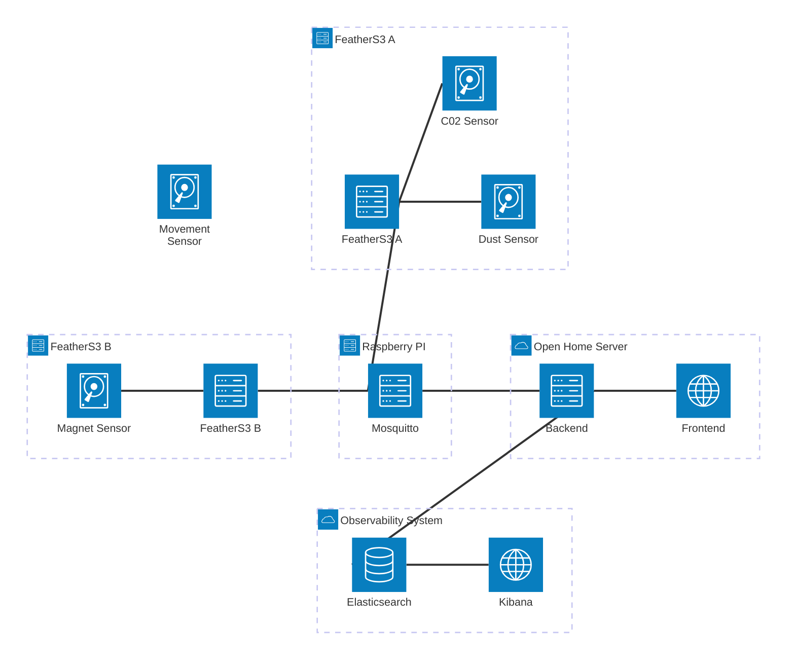

# SensorHub
SensorHub is a set of deployed components that let me manage different sensors.  
I intend to learn about sensors and data transmission in this project. The outcome will probably not be distributable and on some level specific to my installation.

## Goals
- [ ] remote ESP configuration
- [ ] generic sensor data processing
- [ ] security
    - any sensor can appear and send data to the MQTT broker
    - sensors must be authorized on my UI
        - there should be a page where you can see all sensors and also what sensor has been approved and which ones are still waiting for authorization
- [ ] there should be a dynamic kibana dashboard to visualize all sensor data
- [ ] ESP does not loose data if MQTT server is not reachable

## Building Blocks
The end product consists of many different components that work together. Here is a quick documentation of each component.

### Backend Service
- implemented in go
- hosted on my local server
- [ ] Receive sensor data from an MQTT broker
- [ ] send sensor data to elastic
- [ ] require sensor registration
- [ ] remotely configure sensor
- [ ] in memory / in file data buffer to account for data sent from an unauthorized device
- [ ] (optional) automatic buffering / bulk posts to elastic if throughput is high

### Web Frontend
- [ ] Dynamic Kibana Dashboard for each sensor
    - value over time
    - current value
    - count of values transmitted over time (throughput)
    - (if battery connected) line graph battery level
- [ ] Other Kibana views: 
    - [ ] MQTT Metrics
    - [ ] Backend Metrics and Logs
- [ ] Web Frontend
    - implemented using angular
    - [ ] ESP registration page
    - [ ] Remote ESP configuration page
    - [ ] Kibana Dashboards embedded?

### MQTT Service
- Mosquitto
- [ ] running on raspberry pi
- [ ] hosted in local network

### FeatherS3
- [ ] standalone "module" for each sensor
- [ ] connect to WiFi
- [ ] publish available configuration
    - each sensor "module" can add more configurations
- [ ] periodically update configuration (if changed from remote via MQTT broker)
- [ ] periodically send "generic" sensor data to MQTT broker
- [ ] small in memory data buffer to cache data if MQTT broker was not available

### Sensors
Current available sensors:
- C02  
    - DataType: floating point number (ppm)
- temperature  
    - DataType: floating point number (celsius)
- humidity  
    - DataType: floating point number (percent)
- Dust  
    - DataType: floating point number (?)
- Movement  
    - DataType: ?
- Magnet  
    - DataType: flag (on/off)

## Network map

## Limits
Here is a list of Ideas I've decided not to implement for various reasons. If I get bored, I can come back here and implement an Idea.

- extreme efficiency for battery powered ESPs
    - BLE
    - low level framework (no Cirquit Python)
- Publicly accessible MQTT Broker
    - currently my "public" endpoint to my network only supports http (80 / 443). I do not want to change this in the near future.
- The setup will not be 100% secure.
    Known issues:
    - whoever can get access to an authorized sensor ID and name will be able to mimic this sensor and is authorized.