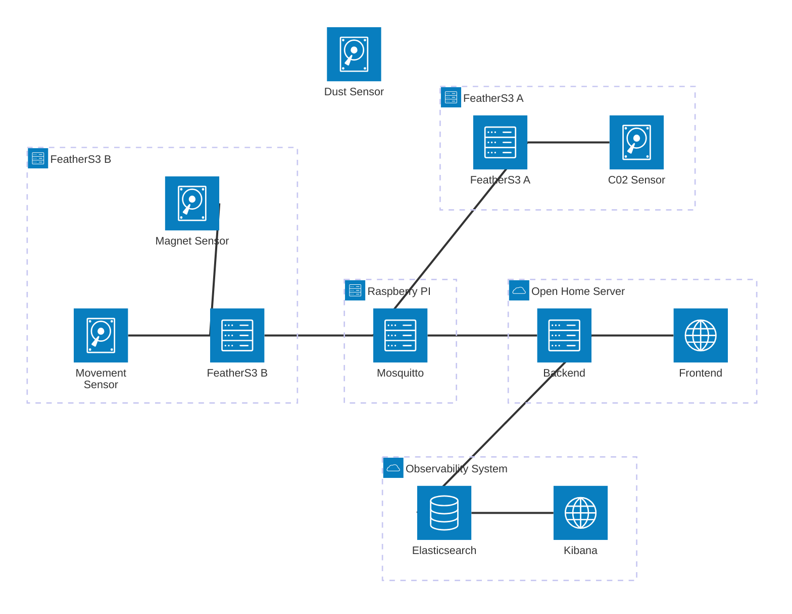

# SensorHub
SensorHub is a set of deployed components that let me manage different sensors.  
I intend to learn about sensors and data transmission in this project. The outcome will probably not be distributable and on some level specific to my installation.

## Goals
- [x] remote ESP configuration
- [x] generic sensor data processing
- [x] security
    - any sensor can appear and send data to the MQTT broker
    - sensors must be authorized on my UI
        - there should be a page where you can see all sensors and also what sensor has been approved and which ones are still waiting for authorization
- [x] there should be a dynamic kibana dashboard to visualize all sensor data
- [ ] ESP does not loose data if MQTT server is not reachable

## Building Blocks
The end product consists of many different components that work together. Here is a quick documentation of each component.

### Backend Service
- implemented in go
- hosted on my local server
- [x] Receive sensor data from an MQTT broker
- [x] send sensor data to elastic
- [x] require sensor registration
- [x] remotely configure sensor
- [x] in memory / in file data buffer to account for data sent from an unauthorized device
- [x] (optional) automatic buffering / bulk posts to elastic if throughput is high

### Web Frontend
- [x] Dynamic Kibana Dashboard for each sensor
    - value over time
    - current value
    - count of values transmitted over time (throughput)
    - (if battery connected) line graph battery level
- [ ] Other Kibana views: 
    - [ ] MQTT Metrics
    - [ ] Backend Metrics and Logs
- [x] Web Frontend
    - implemented using angular
    - [x] ESP registration page
    - [x] Remote ESP configuration page
    - [ ] Kibana Dashboards embedded?


### MQTT Service
- Mosquitto
- [x] running on raspberry pi
- [x] hosted in local network

### FeatherS3
- [x] standalone "module" for each sensor
- [x] connect to WiFi
- [x] publish available configuration
    - each sensor "module" can add more configurations
- [x] periodically update configuration (if changed from remote via MQTT broker)
- [x] periodically send "generic" sensor data to MQTT broker
- [ ] small in memory data buffer to cache data if MQTT broker was not available

### Sensors
Current available sensors:
- C02  
    - DataType: floating point number (ppm)
- temperature  
    - DataType: floating point number (celsius)
- humidity  
    - DataType: floating point number (percent)
- Dust  
    - DataType: floating point number (?)
- Movement  
    - DataType: flag (on/off)
- Magnet  
    - DataType: flag (on/off)

## Network map


## How To Setup
Generally, I have created this project for my education. This means, I have implemented many things rather strictly and not dynamic. This means, in some points, I would have programmed things more dynamic if the initial plan was to ship a product. Especially when it comes to external dependencies.
For Example, my backend strictly requires an API key to connect to Elastic and it strictly required a User and Password to authenticate itself on the MQTT broker. In a product that is intended to be run by other people, I would have implemented this more dynamically.

### Elastic
the first step to setup SensorHub is to get an Elasticsearch DB running somewhere accessible. Only the Backend needs to access this DB. So it does have to be publicly accessible, but it could be obviously.
In Elastic an API key with the rights to create indices has to be created. This API key will later be used by the Backend to store the sensor data.

When installing Elasticsearch I would recommend to also setup Kibana. Kibana provides a UI that drastically simplifies the setup. But all the steps could also be done via commands in the terminal or via the Elastic HTTP API.

Next, the dynamic index template needs to be pushed to elastic. This ensures that the Sensor data pushed to elastic is stored properly (as a timeseries data stream with the correct dynamic timeseries data fields).

### PostgreSQL DB
The Backend uses a two tables in a postgres DB to keep track of the devices from which data was received and their current configuration. It also stores whether a device has be authorized or not.
So, setup a PostgreSQL DB that is accessible by the backend. Maybe create a suitable user. And run the `init_db.sql` script. This will create the required tables.

### MQTT Broker
The next step would be to setup an MQTT Broker. I used Eclipse Misquitto for various reasons, but it is not mandatory to use this one. You can use any application that can traffic MQTT messages.
My backend currently requires a user and password to be set for the connection to an MQTT broker. If you configured your MQTT broker to be open to anyone, you can just put arbitrary values into the MQTT user and password configuration.

### SensorHub backend
Now we can setup the backend. It is a go application that is configurable via a set of environment variables. Generally I recommend running it in a Docker container and I am using a `.env` file to set all the environment variables.
To get this Docker container running, create a `.env` file with the following configurations:
```env
DB_HOST=
DB_PORT=
DB_NAME=
DB_USER=
DB_PASSWORD=

MQTT_BROKER_URL=
MQTT_BROKER_USER=
MQTT_BROKER_PASSWORD=

ELASTIC_URL=
ELASTIC_API_KEY=
```

Then run the `run_docker.sh` script or run equivalent commands that the script would run.

If nothing was changed in the run_docker.sh script, then the backend will be accessible on the local network on port 8282.

### Sensors
Now that all the infrastructure is setup we can turn our attention to the actual data gathering.

Generally I have worked with FeatherS3 ESP32 boards. They support circuit python. The code in the `FeatherS3` package depends on hardware specific APIs, so it probably won't be directly portable to any other micro controller.

To setup the micro controller, connect it to your computer and copy the content of the `code.py` file into the `code.py` file on the micro controller.
All the other files in the `FeatherS3` directory have to be copied into the `lib` directory on the micro controller (including the dependencies, but take them out of the dependencies folder).
There is an exception though. I have implemented three "sensor readers". These are lib files that have an identical structure but read data from a specific sensor. Currently a movement sensor, a magnet sensor and the SCD30 (co2) sensor are properly implemented. You only have to move the reader files to your `lib` dir on the micro controller for the connected sensors. The `code.py` is designed to check what sensor implementation is available and only tries to read from these sensors.

You can easily add another sensor to the lineup. Just copy any `*_reader.py` file and replace the sensor specific things and also update `code.py` (repeat all the boiler plate code that is written for each reader file. This is a bit annoying, but I did not have enough time to improve this.). You must ensure that the sensor reader returns data in the `proto.Measurement[]` format. But the `Measurement` type should be dynamic enough to support any kind of sensor data.
Also, another pitfall is: I have not implemented any "central" timing or waiting. `code.py` just calls all configured reader files sequentially in an endless loop. So if a sensor can read data every millisecond, then `code.py` will also do so. This is probably not the best Idea, so I recommend adding a `asyncio.sleep` to the reader. This is also a point that should certainly be improved, but for now it works good enough.

Then each micro controller needs to be setup with an initial configuration. Here is the template. The sensor specific configurations can be left out if the sensor is not connected.
(replace the `<...>`)
```toml
DEVICE_NAME = "<any_name>"

MODULE_SCD30 = <0 if the module should be disabled, 1 to enable (default 0)>
MODULE_PM25 = <0 if the module should be disabled, 1 to enable (default 0)>
MODULE_PIR = <0 if the module should be disabled, 1 to enable (default 0)>
MODULE_DOOR = <0 if the module should be disabled, 1 to enable (default 0)>

WIFI_SSID = "<ssid>"
WIFI_PASSWORD = "<password>"

BROKER_URL = "<URL to the MQTT broker>"
BROKER_PORT = <broker port>
BROKER_USERNAME = "<broker username>"
BROKER_PASSWORD = "<broker password>"

SCD30_MEASUREMENT_INTERVAL = <int>
SCD30_ALTITUDE = <int>
SCD30_AMBIENT_PRESSURE = <int>
SCD30_TEMPERATURE_OFFSET = <int>
```

### Kibana
Optionally, you can configure Kibana Dashboards to see the received data plotted to a graph. The dashboard I have created is in the export in the `kibana` directory.

## Limits
Here is a list of Ideas I've decided not to implement for various reasons. If I get bored, I can come back here and implement an Idea.

- extreme efficiency for battery powered ESPs
    - BLE
    - low level framework (no Cirquit Python)
- Publicly accessible MQTT Broker
    - currently my "public" endpoint to my network only supports http (80 / 443). I do not want to change this in the near future.
- The setup will not be 100% secure.
    Known issues:
    - whoever can get access to an authorized sensor ID and name will be able to mimic this sensor and is authorized.
- a microchip cannot have the same sensor type connected multiple times...
- the error handling in the backend is not really good. If any network error or so occurs data might be lost but since the sensor data delivery is not 100% essential, I've skipped this for the first part