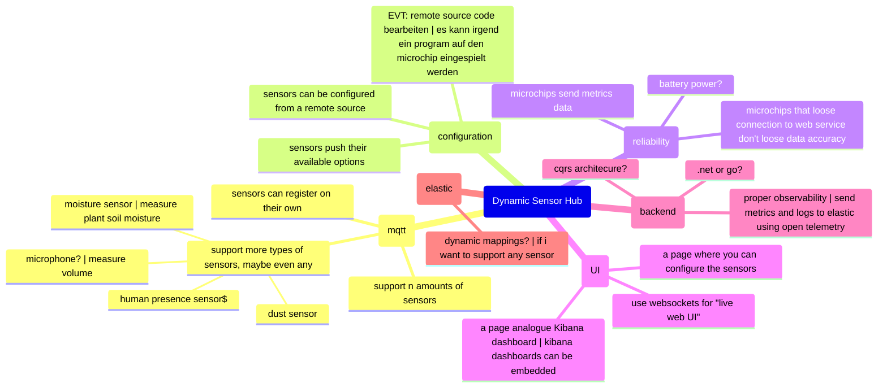

# Project Log
This documents contains a simple documentation of what I did and what I plan to do. I'll update it after every working session.

## Session 01
- Unterstand Assignment
- Workout plan
- Getting started with micro:bit
- Get started with reading sensor data
- Write a go lang app that reads the data from the serial port an stores it in a csv file.
- use python and the provided template to draw plots

### Getting started with micro:bit
Reminder: Connect the USB Cable to the micro:bit controller and not to the grove board. When connected to the grove board, you cannot upload micro:bit programs. (There is no disk mounted to the computer.)

### Getting started with reading sensor data
(AI and Google were used to find answers for some of the questions)  
**What does the number in the screen command do?**  
`screen /dev/tty.usbmodem102 115200`  

This Number is the Baud Rate. This number is defined by the writing device. The reader must match this rate, otherwise the data will be read wrongly.  

What is a Baud Rate?: https://riverdi.com/blog/understanding-baud-rate-a-comprehensive-guide  
It defines the number of signal changes per second. The higher the Baud Rate the more data gets through per second. 

Bit rate is something similar. Usually a Baud Rate of 1 results in 1bps (bit per second). But there are different scenarios where you can "encode" more than one bit into one signal change resulting in higher throughput. 


**What is the unit of the data measured?**  
C02:  
- Provided in ppm (parts per Million) 
    - 10'000ppm = 1% of "Air" is CO2
- Range: 400ppm - 10'000ppm  
- Accuracy: +- 3%
- sensor measures the value using NDIR (Non-Dispersive Infrared)

Humidity:  
Measured in %. 
100% means the Air has reached the maximum amount of water vapor possible at the current temperature. When the temperature changes then the maximum amount also changes. 
If the amount were to increase above 100% then the air becomes water. 

Temperature:  
You can choose between Fahrenheit and Celsius.

**Why the I2C port?**  
Because this is an "intelligent" port. Over this port actual "structured" data is sent. The other ports just receive an analog or digital signal. (raw voltage)

### Use python
I have never properly used python. This is why I've consulted Gemini for help here. I did not copy code directly but I certainly received a lot of help from the LLM.


## Session 02
- Understand the FeatherS3
- send sensor data over serial
- send sensor data over WiFi
- create service that receives the sent data over WiFi
- send sensor data to elastic
- create small kibana dashboard


### Getting started with FeatherS3
Trying to understand the code from the documentation:
Sources: 
- https://docs.circuitpython.org/projects/scd30/en/latest/
- https://gemini.google.com/share/0ad50dbfe1d2

```python
import time
import board
import adafruit_scd30

# What does the following comment mean?
#   "SCD-30 has temperamental I2C with clock stretching, datasheet recommends starting at 50KHz"
# "temperamental I2C" -> the sensor returns data using the I2C protocol and has its own serial clock.
# "clock stretching" -> Master (FeatherS3) requests data at a fixed frequency. But the Slave (sensor) needs time to process the analogue data actually read by the sensor. This means the slave cannot provide accurate data at a fixed frequency. To solve this the slave does clock stretching (letting the master wait until he has finished processing the sensor data)
#
# Why did this line not work? What is the difference to the line I've written
#   "i2c = busio.I2C(board.SCL, board.SDA,frequency=50000)"
# The default line did not work because it was missing the import statement of "busio"...
#
# board.SCL points to the pin with the serial clock
# board.SDA points to the pin with the serial data
# busio.I2C configures the two GPIO (not specific purpose pins, can be programmed to anything) pins (SCL, SDA) to use the I2C protocol
# frequency=50000: do not change this. 50kHz is the most reliable. Increasing it might work but will probably result in wrong data from the CO2 sensor.
i2c = board.I2C() # this probably just a wrapper to the busio call.

# initialized an object with the high level api to access the sensor data.
scd = adafruit_scd30.SCD30(i2c)

while True:
    # What is meant by this?
    #   "since the measurement interval is long (2+ seconds) we check for new data before reading the values, to ensure current readings."
    # Due to physical constraints the CO2 value can only be measured approximately every 2 seconds. If we poll more frequently we won't see a real change in the value (maybe some jitter due to inaccurate floating point operations)
    # this interval could be changed here: scd.measurement_interval
    # do not assign a value lower than 2 because this will result in inaccurate data, but the value can always be increased.
    if scd.data_available:
        print("Data Available!")
        print("CO2:", scd.CO2, "PPM")
        print("Temperature:", scd.temperature, "degrees C")
        print("Humidity:", scd.relative_humidity, "%%rH")
        print("")
        print("Waiting for new data...")
        print("")

    time.sleep(0.5)
```

### Connecting the ESP to my mac using WiFi
https://learn.adafruit.com/networking-in-circuitpython/networking-with-the-wifi-module

### Level 3 Prototype
I'll create a C# service that exposes an HTTP endpoint, which will receive data from the ESP and send it to elastic. 
Kibana will then visualize this data.
The C# service lives in a docker container exposed to the internet. 
The ELK Stack is also already setup in my local network and is exposed to the internet.
The ESP with have authenticate itself by the backend using an API key.

#### Configuring Elastic indicies properly
I found, that elastic supports timeseries data storage. This is optimal for my usecase, but I need to read into this technology and figure out how I can apply it for my usecase.

https://www.elastic.co/docs/manage-data/data-store/data-streams/set-up-tsds

First, I have to create an index template. This is what this template does: 
- Doesn't create indices but a data stream
    - a data stream is a set of automatically managed indices. The application can just send data to this data stream (looks like an index from the api), but elastic will manage large amounts of data much more efficiently
- enables Timeseries Mode
- allows for automatically created indices
- configures the timeseries data structure: 
    - defines the index.routing_path
        - in my case: 
            - sensor_type
            - device_id
        - these are the fields that uniquely identify a timeseries (kind of like the group by in an SQL select statement)

Then I created a component template. I there, i defined the mapping of the fields to their type:
- device_id: keyword, timeseries dimension
- sensor_type: keyword, timeseries dimension
- co2: double, timeseries gauge metric
- temperature: double, timeseries gauge metric
- humidity: double, timeseries gauge metric
- the field @timestamp is automatically added as a date.

#### Kibana Dashboard
Further Idea: 
Visualize the angle of increase per 15 minutes or so (how quickly is the air quality getting worse, at what time of the day is the worst, is it getting exponentially worse or just linearly)


## Session 3
This session should result in a complete product. Here is a small brainstorm of what could be done:



The actual project and its plans are documented in the README.md in the level-4 directory.

### Technology evaluation

#### HiveMQ vs Mosquitto
These are the two relevant MQTT Brokers for me. Now I need to decide which one fits my project better. 
HiveMQ has a WebUI that allows for a lot easier debugging and analysis. In HiveMQ you can also write custom plugins to process messages before any subscriber sees them. 
But HiveMQ is a lot heavier than Mosquitto. Mosquitto could even be run on a raspberry PI.
HiveMQ could be scaled vertically, but I think I do not need this anyways.

So now the question arises, why so I need an MQTT broker? What benefits do I gain by this? Its basically just a message bus... Well, its not just a message bus. It allows the micro controller to send data in a very lightweight format. Also, this is important, MQTT allows for easy bi-directional communication. With this in mind, I should certainly use an MQTT broker. But which one.

I'll decide for Mosquitto as my MQTT broker. Because it is lightweight and I do not think that I need the heavy features from HiveMQ and I can run Mosquitto on my raspberry pi.


#### WiFi vs Bluetooth
The ESP32 needs to send data to an MQTT broker. And the ESP32 needs to be able to receive configuration changes from any MQTT message sender.  
If I were to decide for WiFi, this would be simple. The ESP can just connect to an MQTT broker and let the broker handle the communication.
If I were to decide for BLE, this would be a lot more complex. Because the MQTT broker is only available over TCP. This means the I would have to setup & program a layer that copies the bi-directional communication from MQTT to a Bluetooth device. It seems very hard to implement this reliably. 

So I'll decide for WiFi, but if there is time remaining, I'll figure out how my app would work if data was sent over bluetooth.


#### Battery vs wired power
Initially, I'll use wired power. It makes many things easier. First, the hardware is less fragile / complicated. And secondly, I can use WiFi without having to worry about power consumption. Especially since I plan to send much data over the Network, i'll probably be struggling hard with power efficiency.


### Progress
Now that the technology questions are mostly out of the way, we can begin with the actual implementation. I've started with setting up an MQTT broker (mosquitto) on my raspberry pi. This went almost perfectly, I had some issues with the network, as always, but thats fine and I managed to solve it in the end. 

Then since I've decided to use protobuf for the data transmission, we first need to understand how protocol buffers actually work and how I should write a .proto file. So lets read into this: https://protobuf.dev/getting-started/gotutorial/.
Okay, .proto files are relatively easy to understand and integrate very nice into a go project. But now how does it work for circuitpython on the FeatherS3? This is where it gets a bit more trickier, I think. Found this: https://github.com/dogtopus/minipb/blob/master/minipb.py. But how do I run this in to FeatherS3, i need to install the dependencies as well.

After some figuring out I managed to get everything running and send sensor data from the microprocessor to an MQTT broker. Nice!!

But I ran into one python pitfall that caught me of guard. I am sending the IP-Address in my data body. On the FeatherS3, i get the IP like this: `wifi.radio.ipv4_address`. This returns an "Address" object, but i was expecting a string to be returned. Then during the encoding of my data object, there was an error thrown, because "Address" cannot be encoded. After a rather long search for the problem, i stepped down and asked Gemini, who then found the issue...
The solution was then to simply convert `wifi.radio.ipv4_address` into a string.

#### Frontend
I have quite some frontend experience with many tools like Angular, React, Svelte and so on. But I have never used HTMX before. So in this project I want to use HTMX. Apparently it works very well in combination with go gin. 
Is it better for my project than other frameworks? Well, I don't think so. The deployment should be 0 effort. Also it is cool to learn something new. But I think a common web framework could do the job just as good if not even a bit better. In HTMX the goal is to no write a single line of JavaScript. While this is nice, this also reduces your flexibilities. So lets see if I can implement my ideas without any JavaScript. 
To get to know HTMX, I have also consulted LLMs.